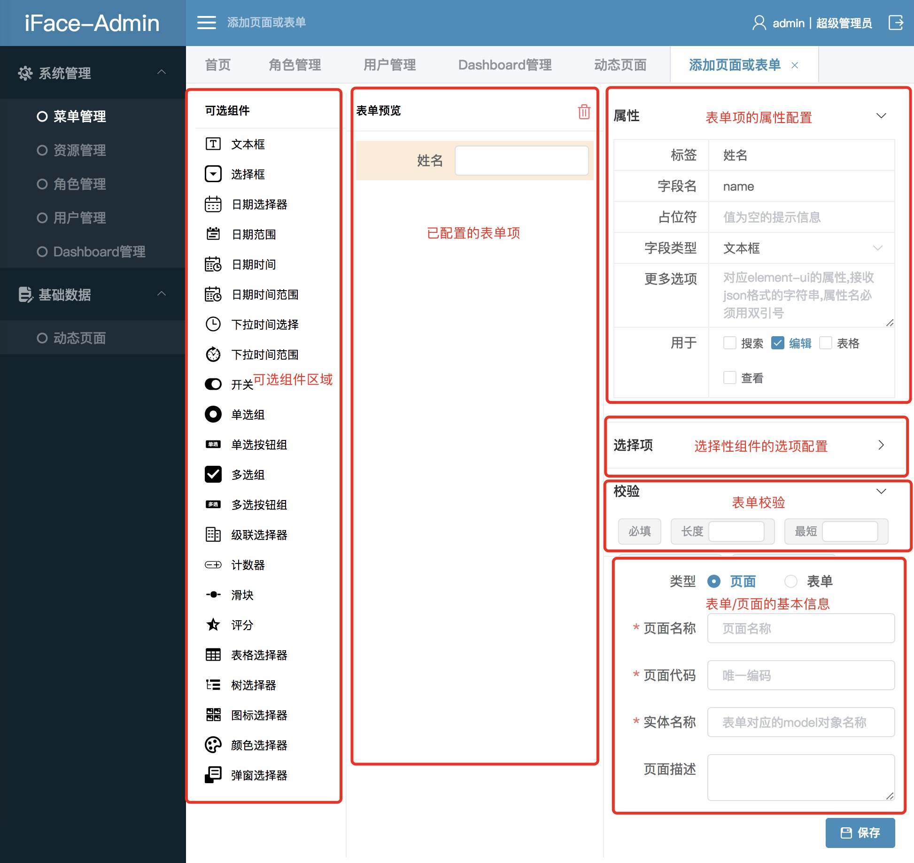

# 动态表单和CRUD

## 如何配置

* 您可以访问`/baseData/pageList`查看已有的表单和CRUD页面，并可以通过添加按钮，添加一个表单或CRUD页面
* 添加界面的功能区划分大致如下：



* 表单和CRUD的配置是同一个页面，通过选择类型，会有一些不同的配置项
* 表单项的属性区域可以配置每个表单组件的基本属性，因为iFace提供的所有可选组件都是基于elementUI封装过的组件，所以理论上支持elementUI组件的所有属性，但这些每个组件的属性太多，在属性配置区域列出所有的属性来填写不太现实，所以，这个区域只列出了一些重要的属性，如果需要配置其它属性，请在更多选项的输入框以JSON字符串的形式输入。
* “用于”多选组仅在配置CRUD页面的时候可用，意思是当前的表单项，除了作为表单外，是否作为表单的列、查看页面的字段等
* 在表单/页面基本信息区域，注意页面/表单代码这个输入框，这个代码是后面使用这些配置好的页面或表单的时候必须要使用的一个唯一的编码

## 如何使用动态表单

通过系统配置好的表单，iFace提供了一个组件，用于直接使用

```markup
<cc-form-dynamic :model="selected" form-code="menu"></cc-form-dynamic>
```

#### 属性

| 属性名 | 类型 | 说明 | 是否必须 | 默认值 |
| :--- | :--- | :--- | :--- | :--- |
| model | Object | 表单绑定的对象，表单录入的值会同步更新到这个对象 | 是 | - |
| formCode | 表单的code | 对应系统已经配置好的动态表单的code（表单代码），组件会通过这个code获取到表单项用于渲染表单 | 是 | - |
| 其他 |  | 理论上支持elementUI的form组件的所有属性 |  |  |

#### 事件

| 事件名 | 参数 | 描述 |
| :--- | :--- | :--- |
| beforeSave | - | 表单保存前触发，如果此方法返回false，表单将不提交，返回ture，表单才能提交 |
| save | Object | 表单提交后，接口返回的数据 |

## 如何使用动态CRUD页面

使用配置好的CRUD页面，只需添加一个菜单，将菜单的url设置为CRUD页面的code（页面代码）即可。当然，您还需要提供search\*、save\*、del\*、get\*、view\* 5个接口，具体规则见 [服务端-动态CRUD ](https://ccqiuqiu.gitbook.io/iface/service/crud)

## 格式化列

在自定义页面中的表格，我们可能需要对某一列进行格式化，这对于elementUI的表格来说给列定义一个格式化的方法就可以了，但是iFace的动态页面的表单是自动生成的，为了安全，我们不能在配置列的在输入框写格式化的方法，所以退而求其次，iFace提供了2种方式来实现这个目的

1. 后端格式化，这种方案适用于像性别这样，数据库保存值，前端需要显示文本的情况，并且后端转换成本较低的情况
2. 前端通过方法名格式化，这种方案需前端事先写好一些格式化的方法，在配置表格列的时候，提供一个方法的列表供选择，数据库尽保存方法名，在显示表格的时候，通过方法名找到正确的方法来格式化列

iFace提供了几个基本的格式化方法，位于 `/src/assets/utils/crudUtils.tsx` 可以在这个文件格式化增加格式化的方法，这些方法将自动显示在列格式化的下拉选择框中，请注意添加的时候并不是直接增加function，根据情况，可以添加2种不同的对象，对应不同的格式化方式

```javascript
// 1. 对象名以Format结尾，这个对象的format方法，一般返回的是经过处理的文本
// format方法的入参是分别是：当前行的数据、当前列的对象、当前列的值
sexFormat: {
  label: '格式化-性别', // 显示在选择框中的文本
  format: (row: any, column: any, cellValue: number) => {
    return constant.SexK[cellValue]
  },
}

// 2. 对象名以Render结尾，这个对象的format方法返回一段JSX
// format的入参是：渲染函数、当前列的值、当前行的数据、当前行的索引、当前列的数据、table 内部的状态管理
// 其中第一个参数渲染函数名字必须为h，不能更改
statusRender: {
  label: 'JSX-状态',
  format: (h: any, val: any) => <el-tag size='small' type={val === constant.StatusV.禁用 ? 'info' : ''}>{constant.StatusK[val]}</el-tag>,
}
```


## 数据源

在配置动态CRUD页面的时候，如果表单项是一个选择型组件，那么需要在选项区域配置数据源，iFace提供了2中配置数据源的方式：

1. 自定义 - 通过JSON字符串按照格式自己定义数据源
2. 系统内置 - 选择系统内置的一些数据源
3. 接口 - 通过接口查询数据源

大多数时候，我们应该使用避免使用第1种方式，因为第1种方式数据是固定的。


系统内置的数据源有部分需要后端提供相应的接口才能实现，默认是通过接口`/v1/base/getOptions?code=CODE&type=TYPE`获取，其中code是数据源的标识，后端根据这个标识查询不同的数据，type是数据格式，对应前端不同的组件类型，后端也需要根据这个类型返回正确的数据格式


方式3是最自由的一种方式，只要前端填写接口地址，后端提供这个接口返回数据就行了，但是同样要注意数据的格式一定要和前端组件的类型匹配，前端是树型组件，后端就返回树形组件需要的数据格式。iFace的所有组件都是在elementUI组件的基础上封装的，所有组件需要的数据格式请查阅elementUI相应的文档。

